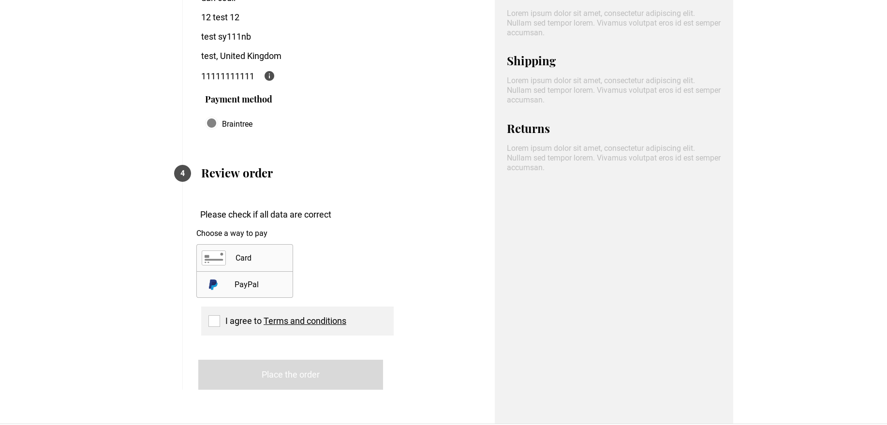

# Vue Storefront Braintree Payment Extension

Braintree Payment module for [vue-storefront](https://github.com/DivanteLtd/vue-storefront), by [Daniel Coull - Sutton Silver].



## Installation:

By hand (preferer):
```shell
$ git clone git@github.com:danrcoull/vsf-payment-braintree.git ./vue-storefront/src/modules/payment-braintree
```

Registration the Braintree module. Go to `./src/modules/client.ts`
```js
...
import { InitialResourcesModule } from '@vue-storefront/core/modules/initial-resources'
import { Braintree } from './payment-braintree';

export function registerNewModules () {
  ...
  registerModule(InstantCheckoutModule) 
  registerModule(Braintree) 
]
```

OR If you use Capybara VS theme. Go to `./src/themes/capybara/config/modules.ts`
```js
...
import { PaymentCashOnDeliveryModule } from 'src/modules/payment-cash-on-delivery'
import { Braintree } from 'src/modules/payment-braintree'
...
export function registerClientModules () {
  ...
  registerModule(NewsletterModule)
  registerModule(Braintree)
}
```

Add the endpoint to your config
```json
  "braintree" : {
    "endpoint": "http://localhost:8080/api/ext/braintree"
  },
```

### dependencies for built
"braintree": "^2.14.0",
"braintree-web": "^3.40.0",
"braintree-web-drop-in": "^1.14.1"


## Braintree payment API extension

Install additional extension for `vue-storefront-api`:
```shell
$ cp -f ./API/braintree ../vue-storefront-api/src/api/extensions/
```
Add the config to your api confg

```json
"extensions":{
   "braintree": {
      "mode": "sandbox",
      "merchantId": "your-merchant-id", ##must match magebnto
      "publicKey": "your-public-key", ##must match magento
      "privateKey": "your-private-key" ##must match magento
    },
}
```

And enable Braintree extension in the config, by adding it to `registeredExtensions` array

```json
"registeredExtensions": [
    "braintree"
]
```


## Add Braintree Drop-in UI to your theme
#### If you use Classic VS theme:

Under your theme `components/core/blocks/Checkout/OrderReview.vue` add the following import to your script

```js
import BraintreeDropin from 'src/modules/payment-braintree/components/Dropin'

export default {
  components: {
    BaseCheckbox,
    ButtonFull,
    CartSummary,
    Modal,
    ValidationError,
    BraintreeDropin
  }
}
```
And within the template after cart-summary add the following

```htmnl
<div class="payment">
   <braintree-dropin v-if="payment.paymentMethod === 'braintree'"/>
</div>
````

#### If you use Capybara VS theme:
Under your theme `components/organisms/o-confirm-order.vue` add the following import to your script

```js
import BraintreeDropin from 'src/modules/payment-braintree/components/Dropin'

export default {
  components: {
    BraintreeDropin
  }
}
```

And add the following code before "Place the order" button

```htmnl
<div class="payment">
   <braintree-dropin v-if="paymentMethod === 'Braintree'"/>
</div>
````

[](https://www.buymeacoffee.com/BHaNOMl)
